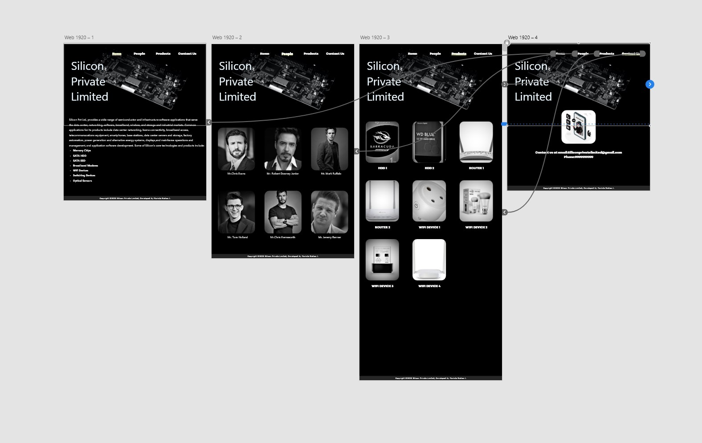
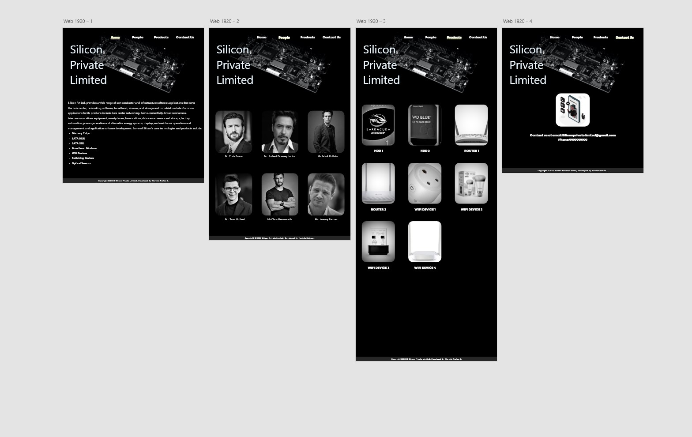

# User Experience Design for a Web Application
## AIM:
To develop an user experience design and wireframe for a product development company website.

## DESIGN STEPS:
### Step 1: 
Requirement collection.
### Step 2:
Choosing the suitable color scheme
### Step 3:
Creating artboards for individual pages
### Step 4:
Designing layout for individual pages
### Step 5:
Creating links and linking it with artboards
### Step 6:
Preview the prototype.

## DESIGN SCREENS:

## WIREFRAME:

## PROTOTYPE:

## RESULT:
Thus, an user experience design and wireframe for a product development company website has been done.